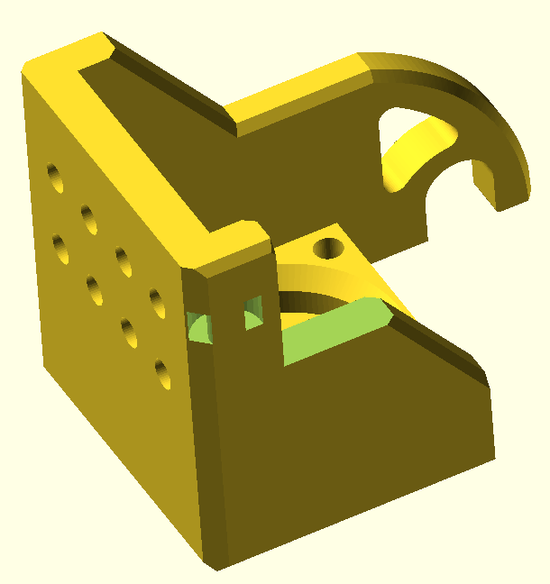

# LumenPnp z gantry motor cradle + PushPullFeeder actuator hook

This is a remix of calipsoii's PushPullFeeder [actuator hook](https://www.printables.com/model/1151234-lumenpnp-referencepushpull-feeder-modifications) for a LumenPnp machine. It adds the cable tie loop for motor cable strain relief present on a v3 machine.

